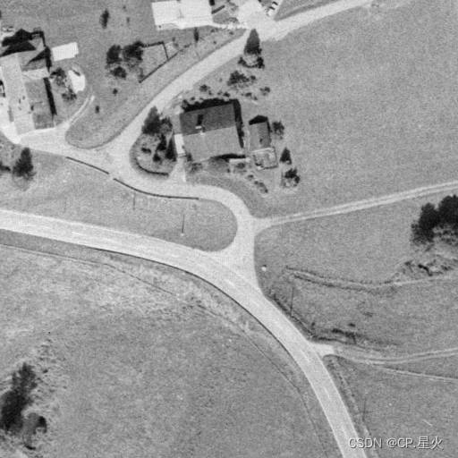
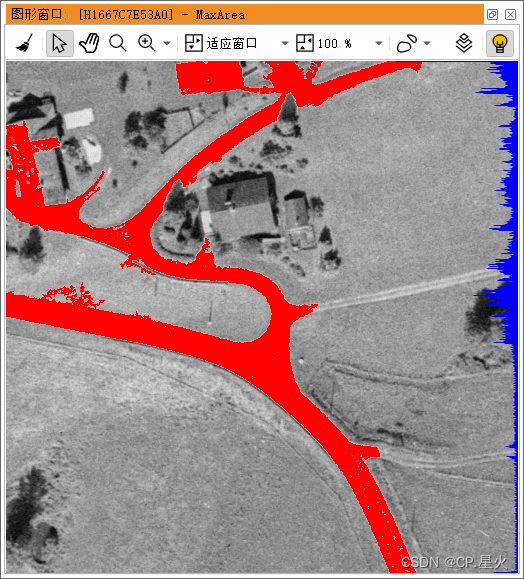

# 轮廓提取





# 示例

```opencl
dev_close_window ()
read_image (Image, 'mreut') 
* 行，列，宽，高，窗口颜色，窗口句柄
dev_open_window (0, 0, 512, 512, 'black', WindowID)
* 使用全局阈值分割图像
threshold (Image, Bright, 180, 255)
* 连接区域组件，连接分割出来的图像
connection (Bright, ConnectedRegions)
* 选择指定区域：超过一定百分比的区域（目前最大）
select_shape_std (ConnectedRegions, MaxArea, 'max_area', 0)
* 获取区域轮廓
get_region_contour (MaxArea, Rows, Columns)
Count := []
dev_display (Image)
dev_set_color ('red')
dev_display (MaxArea)
* 关闭变量的更新
dev_update_var ('off')
dev_update_time ('off')
* 关闭程序执行过程中PC（程序计数器）的更新
dev_update_pc ('off')
for r := 0 to 511 by 1
    Count[r] := 0
endfor
* 当前计时
count_seconds (Seconds1)
for i := 0 to |Rows| - 1 by 1
    Count[Rows[i]] := Count[Rows[i]] + 1
endfor
count_seconds (Seconds2)
Time := Seconds2 - Seconds1
dev_set_color ('blue')
get_window_extents(WindowID, Row, Column, Width, Height)
for r := 0 to |Count|-1 by 1
* 指定窗口显示线条（起始行列 —— 最终行列），两点之间
    disp_line (WindowID, r, Width-Count[r], r, Width)
endfor
```

# 算子

## threshold

- `使用全局阈值分割图像`

```opencl
threshold (Image, Region, 180, 255) // 灰度值识别相关对象（前景）
```

1. 从输入 Image 中**选择灰度值** g 满足以下条件的像素: [180, 255]，图像中满足条件的所有点**作为一个区域 Region 返回**；

2. 如果传递了多个灰色值间隔(MinGray 和 MaxGray 的元组)，则每个间隔返回一个单独的区域;

3. 对于向量场图像，（亮像素）阈值不应用于灰度值，而是应用于向量的长度。参数MinGray和MaxGray可以设置为“min”或“max”，以便分别保留底部和顶部限制。

## connection

- `计算区域内连接的组件（连通分量）`

```opencl
connection (Region, ConnectedRegions)
```

1. connection **确定 Region 中给定的输入区域的连接组件**；

2. 用于此的邻域可通过 **set_system('neighborhood'，<4/8>) 检查邻域像素**来设置。默认 8-neighborhood；

3. 连接返回的连接组件的最大数量可以通过 set_system('max_connection'，) 设置。默认值为 0 返回所有连接组件。连接的逆运算符是 union1。

## select_shape_std

- `选择给定形状的区域`

```opencl
select_shape_std (ConnectedRegions, MaxArea, 'max_area', 0)
```

1. 操作符 select_shape_std **将给定区域的形状与默认形状进行比较**。如果该区域具有相似的形状，则将其纳入输出。

2. Shape的可能值有: max_area : 选择的最大区域；rectangle1 : 平行于坐标轴的周围矩形（ROI）通过操作符 smallest_rectangle1 确定。如果“百分比”的面积差大于“百分比”，则采用该区域。rectangle2 : 可以使用操作符 select_shape 将 Feature 设置为 'rectangular '。

## get_region_contour

- `访问对象轮廓`

```cpp
get_region_contour (MaxArea, Rows, Columns)
```

1. 操作符 get_region_contour **返回一个区域轮廓**。等高线是线(行) Rows 和列坐标 Columns 的结果，描述区域的边界。等高线位于区域上。它从最小的行号开始。在这一行中列下标最大的像素处。旋转方向为顺时针。轮廓的第一个像素与最后一个像素相同。忽略该区域的孔；

2. 操作符get_region_contour以元组的形式返回坐标。空区域作为空元组传递。

## count_seconds

- `Passed Time`

```opencl
count_seconds (Seconds1)
```

1. 运算符 count_seconds 有助于**度量时间**。每个运算符调用返回一个时间值；

2. 连续两次调用的值的差值提供了以秒为单位的时间间隔。测量时间的模式可以用set_system('clock_mode'，…) 来设置。
