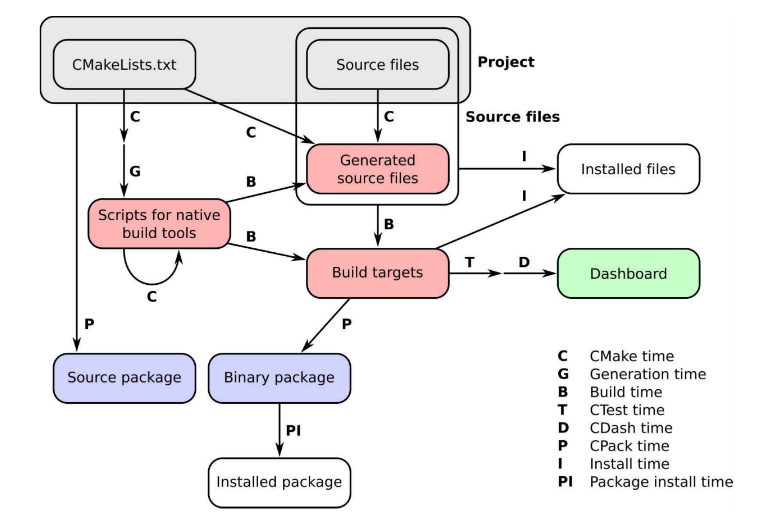
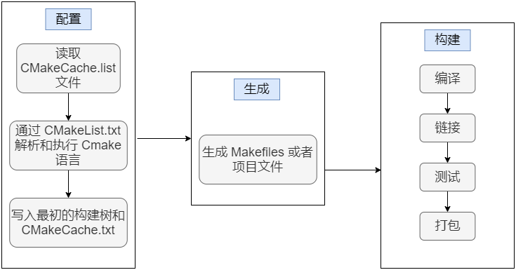

# 1、环境搭建

## 1.1 编译器 GCC，调试器 GDB

```shell
sudo apt update # 需要更新
sudo apt install build-essential gdb

# 确定版本号
gcc --version
g++ --version
gdb --version
```

## 1.2 CMake

```shell
sudo apt install cmake

cmake --version
```

# 2、G++ 编译

## 2.1 编译过程

### 编译预处理 *.i

1. 主要对包含的**头文件（#include）和宏定义（#define, #ifdef ...）**还有**注释**等进行处理；

2. 预处理之后停止编译过程，生成 ***.ii**（**.c** 生成的是 **.i**）文件；

3. **#include** 引入的内容被全部复制到预编译文件中，宏定义也会被相应替换处理。
   
   ```shell
   # -E 仅对源文件进行预处理
   g++  -E test.cpp  -o test.i
   ```
   
   > - 最主要的工作：**宏命令的替换；**
   > - **#include** 单纯导入，可以导入 cpp、txt 文件等等；

### 编译 *.s

1. 语法错误检查，检查无误再翻译成汇编语言；

2. 生成的是和 CPU 架构相关的汇编指令，不同 CPU 架构采用的汇编指令集不同，生成的汇编代码也不一样。
   
   ```shell
   # -S 产生汇编语言文件后停止编译
   g++  -S test.i  -o test.s
   ```

### 汇编 *.o

1. g++ 生成：**g++  -c test.s  -o test.o**

2. 汇编器汇编生成：**as test.s -o test.o**

3. 将汇编代码生成机器可执行的**二进制目标代码**。
   
   ```shell
   # -c 仅把源代码编译为机器语言的目标代码
   g++  -c test.s  -o test.o
   ```

### 链接 bin

1. 核心工作：解决模块间各种符号（变量、函数）相互引用的问题，除了使用 **test.o** 还会将**静态（动态）库链接**一同**生成可执行文件**；

2. **符号重定位**：引用符号（对符号在内存中具体地址的引用），解决当前编译单元如何**访问外部符号**的问题。
   
   ```shell
   # -o 产生指定文件名的可执行文件
   g++ test.o -o test
   # g++ test.o test.so test.a
   ```
   
   > 添加 **g++ --save-temps **参数，保存编译过程中生成的所有中间文件。

## 2.2 G++ 参数

### -g

- 编译**带调试信息**的可执行文件；

- 产生能被 GNU 调试器GDB使用的调试信息，以调试程序。

### -O[n]

- 优化，例如省略从未使用过的变量、直接将常量表达式用结果值代替等等；

- -O 对源代码进行基本优化，如-O2，-O3，-On（n 常为0–3） ：
  
  - **-O** 减小代码的长度和执行时间，等价 -O1；
  
  - **-O0** 不做优化；
  
  - **-O1** 默认优化；
  
  - **-O2** 完成-O1优化之外，还进行一些额外的调整工作，如指令调整等；
  
  - **-O3** 包括循环展开和其他一些与处理特性相关的优化工作。 

### -l、-L

- **-l** : 指定库文件，如 -lglog ；

- **-L** : 指定库文件路径，如 -L/home/lib 。

### -I

- 指定**头文件**搜索路径。

### -Wall、-w

- **-Wall** ：**打印警告**信息；

- **-w** ：**关闭警告**信息。

### -o

- 指定输出文件名，如 -o test 。

### -D

- **定义预处理宏**：-DDEBUG 开启或关闭 DEBUG。

### -fpic

- **position-independent code**，是否创建与位置无关的目标（可行性文件或共享库）；

- PIC广泛使用于[共享库](https://zh.wikipedia.org/w/index.php?title=%E5%85%B1%E4%BA%AB%E5%BA%93&action=edit&redlink=1)，使得同一个库中的代码能够被加载到不同进程的[地址空间](https://so.csdn.net/so/search?q=%E5%9C%B0%E5%9D%80%E7%A9%BA%E9%97%B4&spm=1001.2101.3001.7020)中。PIC 还用于缺少[内存管理单元](https://zh.wikipedia.org/wiki/%E5%86%85%E5%AD%98%E7%AE%A1%E7%90%86%E5%8D%95%E5%85%83)的计算机系统中，使得[操作系统](https://zh.wikipedia.org/wiki/%E6%93%8D%E4%BD%9C%E7%B3%BB%E7%BB%9F)能够在单一的[地址空间](https://zh.wikipedia.org/wiki/%E5%9C%B0%E5%9D%80%E7%A9%BA%E9%97%B4)中将不同的运行程序隔离开来；

- 地址无关代码能够在不做修改的情况下被复制到内存中的任意位置。这一点不同于[重定位代码](https://zh.wikipedia.org/w/index.php?title=%E9%87%8D%E5%AE%9A%E4%BD%8D%E4%BB%A3%E7%A0%81&action=edit&redlink=1)，因为重定位代码需要经过[链接器](https://zh.wikipedia.org/wiki/%E9%93%BE%E6%8E%A5%E5%99%A8)或[加载器](https://zh.wikipedia.org/wiki/%E5%8A%A0%E8%BC%89%E5%99%A8)的特殊处理才能确定合适的运行时内存地址；

- cmake:  **set(CMAKE_POSITION_INDEPENDENT_CODEON)**。

# 3、GDB 调试器

## 3.1 调试命令参数

```shell
$(gdb)help(h) # 查看命令帮助，具体命令查询在gdb中输入help + 命令

$(gdb)run(r) # 重新开始运行文件（run-text：加载文本文件，run-bin：加载二进制文件）
$(gdb)start # 单步执行，运行程序，停在第一行执行语句
$(gdb)next(n)   # 单步调试（逐过程，函数直接执行）
$(gdb)step(s) # 单步调试（逐语句：跳入自定义函数内部执行）
$(gdb)continue(c) # 继续运行
$(gdb)finish # 结束当前函数，返回到函数调用点
$(gdb)quit(q) # 退出gdb

$(gdb)list(l) # 查看原代码（list-n,从第n行开始查看代码。list+ 函数名：查看具体函数）
$(gdb)backtrace(bt) # 查看函数的调用的栈帧和层级关系
$(gdb)info(i) # 查看函数内部局部变量的数值
$(gdb)set # 设置变量的值
$(gdb)display # 追踪查看具体变量值
$(gdb)print(p) # 打印值及地址

$(gdb)undisplay # 取消追踪观察变量
$(gdb)watch # 被设置观察点的变量发生修改时，打印显示
$(gdb)i watch # 显示观察点

$(gdb)info breakpoints # 查看当前设置的所有断点
$(gdb)enable breakpoints # 启用断点
$(gdb)disable breakpoints # 禁用断点
$(gdb)break+num(b) # 在第num行设置断点
$(gdb)delete breakpoints num(d) # 删除第num个断点

$(gdb)x # 查看内存x/20xw 显示20个单元，16进制，4字节每单元
$(gdb)run argv[1] argv[2] # 调试时命令行传参
$(gdb)frame(f) # 切换函数的栈帧
$(gdb)set follow-fork-mode child # Makefile项目管理：选择跟踪父子进程（fork()）
```

# 4、CMake

CMake 始于 1999 年，当时开发公司 Kitware 被委托设计一套工具来简化研究人员的日常工作软件。目标很明确：提供一组工具，可以在不同平台上配置、构建、测试和部署项目。

## 4.1 含义

CMake 本身是一个**工具集**，由五个可执行的程序组成：**cmake、ctest、cpack、cmake-gui、ccmake**。

- **cmake**：用于在构建项目的第一步，进行项目的**配置、生成和构建项目**的主要可执行文件的工作；
- **ctest**：定义测试、测试套件，并设置应该如何执行，用于运行和报告测试结果的**测试驱动程序**；
- **cpack**：为打包需求提供了 DSL，用来生成安装程序和源包的**打包程序**；
- **cmake-gui**：cmake 的**图形界面**；
- **ccmake**：用于图形界面，与 cmake-gui 不同的地方在于ccmake是基**于控制台（terminal）的图形界面**。



> **CDash** 将项目的测试结果在面板中展示。

- **CMake tim**，CMake 运行阶段，将处理项目中的 CMakeLists.txt 文件并进行配置；

- **Generation time**，配置成功后，CMake 将生成本地构建工具所需的脚本，以执行项目中的后续步骤；

- **Build time**，调用编译器，并在特定的构建目录中构建目标。递归的 CMake time 用来实现平台无关的构建；

- **CTest time**，运行项目的测试套件，以检查目标是否按预期执行。

- **CDash time** 或 **report time**，将测试结果上传到面板；

- **Install time**，将项目的目标、源文件、可执行文件和库从构建目录安装到安装位置。

- **CPack time** 或 **packaging time**，项目打包；

- **Package install time**，在系统范围内安装新生成的包。

## 4.2 常用命令

- **cmake_minimum_required** **- 指定CMake的最小版本要求**

> 语法： cmake_minimum_required(VERSION versionNumber [FATAL_ERROR]

- **project** **-** **定义工程名称，并可指定工程支持的语言**

> 语法： project(projectname [CXX] [C] [Java])

- **set** **-** **显式的定义变量**

> 语法：set(VAR [VALUE] [CACHE TYPE DOCSTRING [FORCE]])

```shell
set(SRC sayhello.cpp hello.cpp)
set(EXECUTABLE_OUTPUT_PATH ${PROJECT_BINARY_DIR}/bin)
set( CMAKE_BUILD_TYPE Debug )
```

- **include_directories - 向工程添加多个特定的头文件搜索路径** 

> 语法： include_directories([AFTER|BEFORE] [SYSTEM] dir1 dir2 ...)

```shell
include_directories(/usr/include/myincludefolder ./include)
```

- **link_directories - 向工程添加多个特定的库文件搜索路径**

> 语法： link_directories(dir1 dir2 ...) 

```shell
link_directories(/usr/lib/mylibfolder ./lib)
```

- **add_library - 生成库文件**

> 语法： add_library(libname [SHARED|STATIC|MODULE] [EXCLUDE_FROM_ALL] source1 source2 ... sourceN)

```shell
add_library(hello SHARED ${SRC})
```

- **add_compile_options** - 添加编译参数 

> 语法：add_compile_options

```shell
add_compile_options(-Wall -std=c++11 -O2)
```

- **add_executable - 生成可执行文件**

> 语法：add_executable(exename source1 source2 ... sourceN)

- **target_link_libraries - 为 target 添加需要链接的共享库**

> 语法： target_link_libraries(target library1<debug | optimized> library2...)

- **add_subdirectory - 向当前工程添加存放源文件的子目录，并可以指定中间二进制和目标二进制存放的位置**

> 语法： add_subdirectory(source_dir [binary_dir] [EXCLUDE_FROM_ALL])

- **aux_source_directory - 发现目录下所有源文件并将列表存储在一个变量中，被用来自动构建源文件列表**

> 语法： aux_source_directory(dir VARIABLE)

- **target_include_directories( swap_lib PUBLIC ${PROJECT_SOURCE_DIR}/include ) - 链接静态库目录**

## 4.3 构建流程

1. 建立 build 文件夹，并进入 build 目录：**mkdir build & cd build**
2. 编译上级目录的 CMakeLists.txt 文件，生成 Makefile 和 其他文件：**cmake ..**
3. 执行 make 命令，生成目标：**make**
4. 流程图如下，包括**三个基本阶段：配置、生成、构建阶段**：


