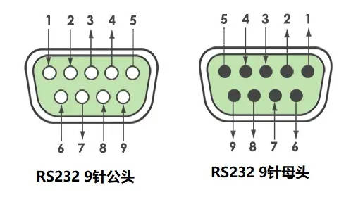
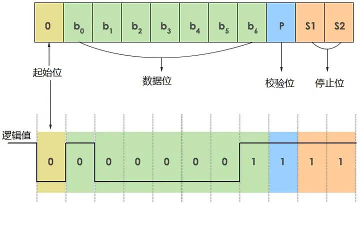

# 通讯协议

- 串口通信：**按位**发送和接收**字节**；
- 规定数据报：**起始位、主体数据、校验位、停止位**（bit），双方都需要约定一致；
- 常用协议：**RS-232**（为主）、RS-422 和 RS-485；

## RS232

- “RS”是“Recommand Standard”的缩写，表示“推荐标准”。“232”是标识号。
- 早期的RS232是为了实现计算机、程控电话、调制解调器之间通信而制定的标准，后来经过多次改版，成了一种通用的串行通信标准；
- 多用于触摸屏、读卡器、扫码枪、打印机等设备与PLC之间的通信；

### 特点

- 信号线少、波特率选择丰富、采用负逻辑传送、传送距离较远、两种物理接口（插头 DCE 端、插座 DTE 端）；
- 缺点：接口信号电平值较高、已损坏接口电路芯片；
- 传输速率较低，异步传输时，波特率为 20Kbps；
- 接口使用一根信号线和返回线而构成共地的传输形式（容易产生共模干扰，所以抗噪声干扰性较弱）；
- 传输距离有限，15 米左右；

### 串行接口

#### 25 针串行接口

- 在 1997年F版本（RS232-F）之前，RS232 使用 25 针串行接口，分为公头和母头；
- 公头用于 DTE 设备（“Data Terminal Equipment ”，数据终端设备）；
- 母头用于 DCE 设备（“Data Circuit-terminating Equipment”，数据电路端接设备）；

#### 9 针串口

- 为了简化 RS232 串口，在 F 版本中进行了定义；

| 编号 | 名称                             | 缩写 |
| ---- | -------------------------------- | ---- |
| 1    | Data Carrier Detect/数据载波监测 | DCD  |
| 2    | Received Data/接收数据           | RxD  |
| 3    | Transmitted Data/发送数据        | TxD  |
| 4    | Data Terminal Ready/数据终端就绪 | DTR  |
| 5    | Ground/接地                      | GND  |
| 6    | Data Set Ready/数据集就绪        | DSR  |
| 7    | Request To Send/请求发送         | RTS  |
| 8    | Clear To Send/清除发送           | CTS  |
| 9    | Ring Indicator/振铃提示          | RI   |

- RXD：接收从 MODEN 发来的串行数据（DCE -> DTE）；
- TXD：将串行数据发送到 MODEN（DTE -> DCE）；
- RTS：用来表示 DTE 请求 DCE 发送数据，用来控制 MODEM 是否进入发送状态；
- CTS：用来表示 DCE 准备好接收 DTE 发来的数据，通知终端开始沿发送数据线 TXD 发送数据；

## 通信机理

假定调制解调器是[全双工](https://baike.baidu.com/item/全双工/310007?fromModule=lemma_inlink)的，并以 RS-232 标准[规范工作](https://baike.baidu.com/item/规范工作/55443613?fromModule=lemma_inlink)。

1. **初始监视并等待振铃**：

   初始状态时，RTS、CTS 持续为 ON，通过通信程序设置和监测 RS232 引线状态。在[应答模式](https://baike.baidu.com/item/应答模式/22587394?fromModule=lemma_inlink)下，计算机中的软件一直监视着[振铃](https://baike.baidu.com/item/振铃/9235371?fromModule=lemma_inlink)指示(RI)，等待 RI 发出 ON 信号；

2. **计数振铃确认进入终端数据就绪**：

   计算机上的通信程序在收到 RI 信号后，就开始通过振铃[指示器](https://baike.baidu.com/item/指示器/4534503?fromModule=lemma_inlink) ON/OFF 变换的次数对振铃进行计数，当到达程设定的振铃次数时，通信程序就发[数据终端](https://baike.baidu.com/item/数据终端/8433840?fromModule=lemma_inlink)就绪([DTR](https://baike.baidu.com/item/DTR/1065171?fromModule=lemma_inlink))信号，强迫调制解调器进入[摘机状态](https://baike.baidu.com/item/摘机状态/56512326?fromModule=lemma_inlink)；

3. **等待调制解调器就绪**：

   等待 2s 后(FCC规定)，调制解调器自动开始发送其应答载波。这时调制解调器发出调制解调器就绪([DSR](https://baike.baidu.com/item/DSR/2776270?fromModule=lemma_inlink))信号通知计算机：它已完成所有的准备工作并等待[载波信号](https://baike.baidu.com/item/载波信号/1293848?fromModule=lemma_inlink)；

4. **检测 DSR 信号随后检测数据载波检测**：

   持续发出 DTR 信号期间，计算机软件监测 DSR 信号。当 DSR 信号变为 ON 时，计算机就知道调制解调器已准备[数据链路](https://baike.baidu.com/item/数据链路/7181323?fromModule=lemma_inlink)的连接，计算机立即开始监测数据载波监测(CD)信号，以证实数据链路的存在；

5. **调制解调器发出数据载波检测**：

   当源调制解调器的载波出现于电话线上时，应答调制解调器就发出CD信号；

6. **开始通信并通过 CD 持续检测数据链路**：

   通过发送[数据线](https://baike.baidu.com/item/数据线/391946?fromModule=lemma_inlink)([TD](https://baike.baidu.com/item/TD/2648455?fromModule=lemma_inlink))和接收数据线(RD)，开始[全双工通信](https://baike.baidu.com/item/全双工通信/8752822?fromModule=lemma_inlink)。在数据链路传输期间，计算机通过监测CD来确保数据链路的存在；

7. **通信完成，关闭数据就绪**：

   通信任务一旦完成，计算机就禁止DTR，调制解调器用除去其载波音调、禁止CD和DSR来响应。随着链路被拆除，调制解调器就会返回初始状态。

## 数据传输

- **点对点**通信；
- 数据帧由四部分组成：起始位、数据位、校验位、停止位；

### 波特率

- 非任意值，常见有：9600，38400，56000，115200 等；

### 数据帧

- 起始位：长度 1，数据值等于逻辑 0，表示开始发送数据；
- 数据位：长度 8 或 7，表示实际发送的数据；
- 校验位：长度 0（无校验）或 1（奇校验或偶校验）；
- 停止位：长度 1、1.5 或者 2，数据值等于逻辑 1，表示数据帧发送结束；

>假设某RS232通信设置波特率=9600，数据位=8，无校验（=0），停止位=1。请问该通信参数下，每秒钟可传输多少个字节的数据？
>
>答：根据参数可知，该通信的帧长度=1+8+1=10 位（bit），在该帧中传输了一个字节（8位）。因此对于9600的波特率，每秒钟最多可传输实际数据=9600/10=960字节。

## 串口传输方式

### 单工

- 数据传输只支持数据在一个方向上传输；

### 双工

- 指二台通讯设备之间，允许有双向信息传输。

#### 半双工

- 允许二台设备之间的双向数据传输，但**不能同时进行**；
- 同一时间只允许一设备传送资料，若另一设备要传送资料，需等原来传送资料的设备传送**完成后再处理**。
- 采用**载波侦听多路访问/冲突检测**；
- 与集线器相连的节点（即多个节点共享一条到交换机端口的连接）必须以半双工模式运行。

举例：

有人将CSMA/CD的工作过程形象的比喻成很多人在一间黑屋子中举行讨论会，参加会议的人都是只能听到其他人的声音。**每个人在说话前必须先倾听**，只有等会场安静下来后，他才能够发言。人们将发言前监听以确定是否已有人在发言的动作称为"**载波监听**";将在会场安静的情况下每人都有平等机会讲话成为"**多路访问**";如果有两人或两人以上同时说话，大家就无法听清其中任何一人的发言，这种情况称为发生"**冲突**"。发言人在发言过程中要及时发现是否发生冲突，这个动作称为"[冲突检测](https://link.zhihu.com/?target=https%3A//baike.so.com/doc/6456170-6669857.html)"。如果发言人发现冲突已经发生，这时他需要停止讲话，然后**随机后退延迟**，再次重复上述过程，直至讲话成功。如果失败次数太多，他也许就放弃这次发言的想法。通常尝试16次后放弃。

#### 全双工

- 允许二台设备间**同时**进行**双向数据传输**；（如，电话，手机）
- 可以用于点到点以太网连接和快速以太网连接，同时不会发生冲突，因为他们**使用双绞线中两条不同线路**。

模拟：当一个设备连接到网络上，需要利用通道存取方法（en:channel access method）使传送的资料及接收资料共用同一物理介质。

##### 时分双工 TDD

- 利用**时间分隔多工技术**来分隔传送及接收的信号（半双工思想）；
- 在非对称网络（上传及下载带宽不平衡的网络）有明显的优点：**缓慢移动的系统**中，动态调整带宽；
- 切换传送或接收时，会浪费一些带宽（**单位时间内网络传输的数据量**）；

##### 频分双工 FDD

- 利用**频率分隔多工技术**来分隔传送及接收的信号；
- 一个设备传送及接收**使用不同的频带**，因此设备传送及接收的资料也不会互相影响；

